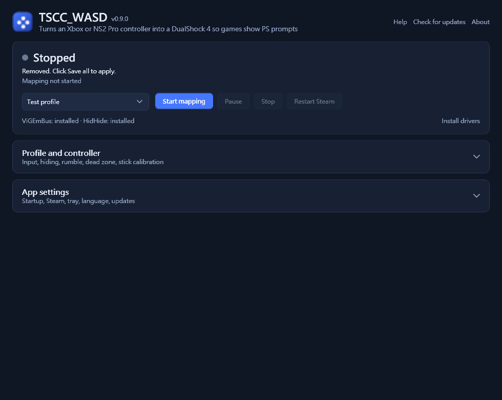

# YnyrWASD

**A free, open-source Windows tool that makes games see your Xbox or Nintendo Switch 2 Pro
controller as a PlayStation DualShock 4, so they show PS button prompts.**

It covers one common reWASD use case ("pretend my controller is a DS4") using free,
open components: ViGEmBus for the virtual DS4 and HidHide to hide the real controller.
Built with C# / .NET 8 / WPF. **MIT licensed · v0.3.0 preview.**

中文使用說明：[繁體中文](docs/README.zh-TW.md)



## Features

- **Auto-detect input (default).** Watches a USB Nintendo Switch 2 Pro and Xbox/XInput
  controllers together and follows whichever one you press. An idle controller never
  takes over. Single-device modes are still available.
- **One persistent virtual DS4.** It stays connected for the whole session. If the
  controller drops, it sends neutral input; if the driver errors, it reconnects.
- **Automatic physical-controller hiding.** When HidHide is installed, starting a mapping
  hides the real controller from games so they only see the DS4. Prompts stop flipping
  between Xbox and PS. Stopping restores your previous HidHide settings exactly.
- **Steam-aware.** Detects a Steam client that grabbed the real controller before hiding
  started, and offers to restart Steam so Steam Input only sees the DS4.
- Face buttons, D-pad, shoulders, stick clicks, sticks and triggers; dead zone and
  polling-rate settings; profiles with import/export.
- No network access, telemetry, background service or auto-updater.

**PS prompts still depend on the game.** The game must support DualShock 4 natively or
through Steam Input. Games that only draw Xbox artwork will keep showing it.

### Not implemented (yet)

Arbitrary remapping, macros, rumble, gyro, touchpad, keyboard/mouse input, DualSense output,
per-game profile switching and overlays. NS2 Pro works over USB only. See the [roadmap](PLAN.md).

## Quick start

1. **Windows 10/11 x64.** Windows 11 is the tested platform.
2. Install the **.NET 8 Windows Desktop Runtime (x64)** from
   [Microsoft](https://dotnet.microsoft.com/download/dotnet/8.0).
3. Install **ViGEmBus** (required) and **HidHide** (strongly recommended) from the
   [official Nefarius downloads](https://docs.nefarius.at/Downloads/), then reboot if asked.
   You do not need to configure HidHide; YnyrWASD does that while it maps.
4. Download a release ZIP (or build it, see below) and run `YnyrWASD.App.exe`.
5. Keep **Input = Auto-detect** and **Hide physical controllers while mapping** checked,
   then click **啟動映射 (Start mapping)**.
6. If YnyrWASD says Steam was already running, choose **Yes** to restart Steam.
7. **Then** launch the game.

### Why the order matters

HidHide stops programs from *opening* a controller. It does not take a controller away
from a program that already has it open. Two situations follow from that:

- **The game was already running.** Restart the game after mapping has started.
- **Steam was already running.** Steam Input keeps forwarding the real controller to Steam
  games, so prompts alternate between Xbox and PS. Restart Steam once mapping is running;
  YnyrWASD offers to do this for you. Keep the game's Steam Input setting on *default/enabled*.
  Games such as *Yakuza 0 Director's Cut* get their PS prompts from Steam Input; with
  Steam Input disabled they fall back to Xbox prompts.

After you stop mapping, the controller is visible again. Steam may need one more
restart before it sees the real controller.

## How it works

```
NS2 Pro (USB HID) ─┐
                   ├─► YnyrWASD (allowlisted in HidHide) ─► ViGEmBus virtual DS4 ─► game / Steam
Xbox (XInput)   ───┘
        ▲
        └── hidden from every other process by HidHide while mapping
```

On start, YnyrWASD:

1. records your current HidHide state in `%APPDATA%\YnyrWASD\hidhide-restore.json`;
2. adds itself to HidHide's application list;
3. hides NS2 Pro and Xbox gaming HID devices, including ones that are currently turned off;
4. turns cloaking on.

Every 5 seconds it also hides any newly connected controller. On stop it undoes only what
it changed. If the app is killed, the next launch restores your settings. YnyrWASD leaves
HidHide alone when HidHide is in inverse-list mode.

**Known limitation:** wired Xbox controllers that use the XUSB driver are not HID devices,
so HidHide cannot hide them yet. Bluetooth Xbox controllers and the NS2 Pro are hidden.

## NS2 Pro notes

Supports the Switch 2 Pro Controller (`057E:2069`) over USB. When Steam owns the control
interface, YnyrWASD reads Steam-initialized HID reports and uses nominal calibration.
Otherwise it initializes the controller and reads its calibration itself.
Button layout follows physical position: B→Cross, A→Circle, Y→Square, X→Triangle.
See [NS2 Pro details](docs/NS2-PRO.md).

## Build, test and package

Use Windows and .NET SDK 8.0.416 or a newer 8.0 feature band allowed by `global.json`.

```powershell
dotnet restore YnyrWASD.sln --locked-mode
dotnet build YnyrWASD.sln -c Release --no-restore -warnaserror
dotnet test YnyrWASD.sln -c Release --no-build
dotnet run --project YnyrWASD.App
pwsh -File scripts/package.ps1
```

Packaging produces a framework-dependent Windows x64 ZIP and SHA-256 checksum under
`artifacts/`. The tests cover input math, auto-detect switching, HidHide hide/restore
logic, error recovery, profile persistence, native layouts and the WPF editor. They do
not prove compatibility with every controller or game. See [validation](docs/VALIDATION.md).

## Configuration and troubleshooting

Profiles live in `%APPDATA%\YnyrWASD\profiles.json`. The previous version is kept as
`profiles.json.bak`. See [profile format](docs/PROFILES.md) and
[troubleshooting](docs/TROUBLESHOOTING.md).

## Similar projects

We know of no maintained open-source tool aimed at Xbox / NS2 Pro → virtual DS4 with
automatic hiding. These projects overlap in part:

| Project | What it does | Difference from YnyrWASD |
| --- | --- | --- |
| [DS4Windows](https://github.com/schmaldeo/DS4Windows) (archived fork; original repo removed) | PS / Switch controllers → virtual Xbox or DS4 | Does not take Xbox controllers as input |
| [BetterJoy](https://github.com/Davidobot/BetterJoy) | Original Switch Pro / Joy-Con → virtual Xbox or DS4 | No Xbox or NS2 Pro input |
| [JoyShockMapper](https://github.com/Electronicks/JoyShockMapper) | PS / Switch controllers → keyboard, mouse or virtual pad, gyro-focused | No Xbox input; text-config driven |
| [Handheld Companion](https://github.com/Valkirie/HandheldCompanion) | Handheld PCs' built-in controls → virtual Xbox / DS4, also uses HidHide | Built for handhelds |
| [x360ce](https://github.com/x360ce/x360ce), [XOutput](https://github.com/csutorasa/XOutput) (archived) | DirectInput controllers → virtual Xbox | Opposite direction |
| [AntiMicroX](https://github.com/AntiMicroX/antimicrox) | Controller → keyboard and mouse | Covers a different reWASD feature |
| [Steam Input](https://partner.steamgames.com/doc/features/steam_controller) | Remaps controllers inside Steam games | Cannot make an Xbox controller show PS prompts |

[HidHide](https://github.com/nefarius/HidHide) and [ViGEmBus](https://github.com/nefarius/ViGEmBus)
are the building blocks YnyrWASD relies on.

## Contributing and license

See [CONTRIBUTING.md](CONTRIBUTING.md), [SECURITY.md](SECURITY.md),
[release checklist](docs/RELEASING.md) and [roadmap](PLAN.md).

YnyrWASD is licensed under the [MIT License](LICENSE). The NS2 Pro protocol portions
adapted from SDL keep their zlib license. Bundled and external components are listed in
[THIRD-PARTY-NOTICES.md](THIRD-PARTY-NOTICES.md).

PlayStation, DualShock, Xbox, Nintendo Switch, Steam and reWASD are trademarks of their
respective owners. YnyrWASD is an independent project and is not affiliated with or
endorsed by them.
