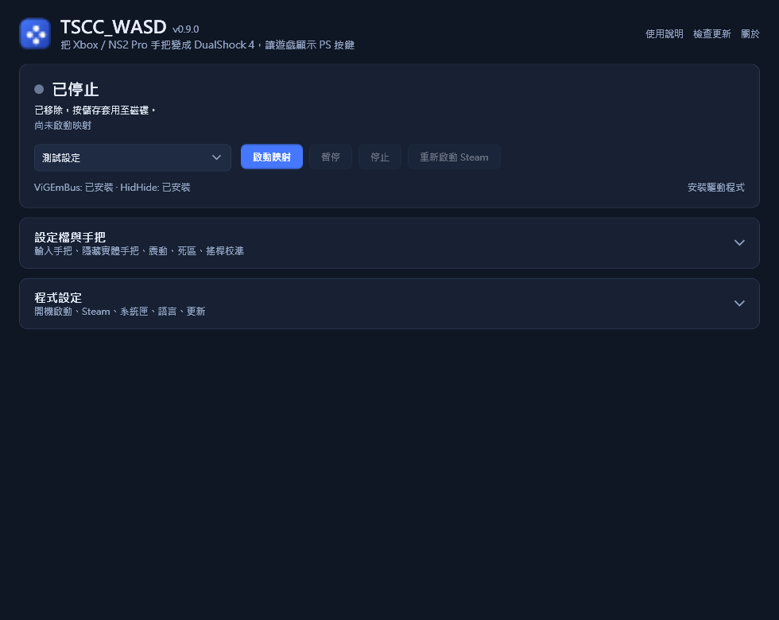

# TSCC_WASD 使用說明

免費開源的 Windows 工具：讓遊戲把你的 Xbox 或 Nintendo Switch 2 Pro 手把當成
PlayStation DualShock 4，顯示 PS 按鍵圖示。對應付費軟體 reWASD 最常用的「偽裝成 DS4」功能，
改用免費元件 ViGEmBus（虛擬 DS4）與 HidHide（隱藏實體手把）完成。
目前為 **0.9.0 預覽版**，介面支援繁體中文與英文。

**名稱由來：** TSCC 是 **T**riangle（三角形）、**S**quare（正方形）、**C**ross（叉叉）、**C**ircle（圓形）
的縮寫，也就是這個工具讓遊戲顯示的四個 PlayStation 按鍵。本專案在 0.4.0 以前叫 *YnyrWASD*，
更新到 0.4.1 時會自動搬移原本的設定檔與設定。

主畫面只放每天會用到的：狀態、設定檔、「啟動映射」。設定檔細節與程式設定收在可展開的區塊裡
（展開後的樣子見[這裡](images/settings.zh-TW.png)）；右上角有「使用說明」「檢查更新」「關於」。

## 功能

- **自動偵測輸入（預設）：** 同時監看 NS2 Pro（USB）、Xbox／XInput，以及（實驗性）DualShock 4、DualSense、
  第一代 Switch Pro 手把，按哪一支就用哪一支，閒置的手把不會搶走控制權；也可以指定只用其中一種。
  實驗性的手把尚未經過實機驗證，歡迎回報結果。PS／任天堂手把搭配「輸出成 Xbox 360」就能顯示 Xbox 圖示。
- **持續存在的虛擬 DS4：** 整段映射期間保持連線；手把斷線時輸出歸零，驅動出錯會自動重連。
- **自動隱藏實體手把：** 安裝 HidHide 後，啟動映射就會把實體手把藏起來，遊戲只看得到虛擬 DS4，
  圖示不會在 Xbox／PS 之間跳動。停止映射會完整還原原本的 HidHide 設定。
- **不必再重啟 Steam：** Steam 比映射早開、握著實體手把時，「自動重新連接」會讓 USB 手把斷電重新連接一兩秒，
  Steam 就會放開它，只看到虛擬 DS4。只需設定一次（一次管理員權限），之後不再詢問。藍牙手把關開一次即可；
  重啟 Steam 只當備案。
- **不必停止就能改設定：** 映射中修改設定、切換設定檔都會立即套用。「暫停」讓遊戲收到放開所有按鍵的 DS4，
  實體手把仍保持隱藏，繼續時不必處理 Steam；「停止」則完全釋放手把。
- **選你習慣的圖示：** 每個設定檔可輸出虛擬 **DualShock 4**（PS 圖示）或 **Xbox 360**（Xbox 圖示，相容性最好），
  也能**對調 A/B 與 X/Y**（任天堂習慣：右邊的鍵確認）。偵測到已知會拒絕虛擬手把的反作弊（EA Javelin）時會提醒。
- **震動、PS 鍵與體感：** 遊戲的震動會轉給 Xbox 或 NS2 Pro；Xbox 的 Guide 鍵與 NS2 的 Home 鍵當作 PS 鍵，
  Xbox 的 View 鍵（可改成 Share）與 NS2 的截圖鍵當作觸控板按下；NS2 Pro 的陀螺儀與加速度計會轉成 DS4 體感。
- **設定一次就好：** 可選擇登入 Windows 時自動啟動、縮在系統匣直接映射，並在隱藏手把後才啟動或重啟 Steam，
  從此不用手動重啟 Steam。
- **下載一次就齊全：** Release ZIP 內含 .NET 執行環境，以及 ViGEmBus、HidHide 的官方安裝程式。
  開啟時若偵測到缺少驅動，會詢問是否安裝（也可以隨時按「安裝驅動程式」）；執行前會先核對固定的 SHA-256。
- **方便回報問題：** 本機日誌（`%APPDATA%\TSCC_WASD\logs`，保留 7 天），以及「關於 → 複製診斷資訊」
  （版本、驅動程式、手把狀態）。映射中時系統匣圖示會出現綠點。
- 常用按鍵、方向鍵、搖桿、扳機；死區與輪詢頻率；設定檔匯入／匯出。
- 不收集遙測、沒有背景服務、不會自動更新。只有你主動要求時才會連網：「檢查更新」向 GitHub 查詢最新版本
  （或在設定中開啟啟動時檢查）；「安裝驅動程式」只在 `drivers` 資料夾裡沒有安裝檔時，才從 GitHub 下載官方安裝程式。
  不會自動下載或安裝更新。

**PS 圖示仍取決於遊戲：** 遊戲必須原生支援 DS4，或透過 Steam Input 支援。只內建 Xbox 圖示的遊戲還是會顯示 Xbox。

尚未支援：任意按鍵重排、巨集、觸控板滑動、鍵鼠、DualSense 輸入與輸出、依遊戲切換設定檔、疊圖。
NS2 Pro 僅支援 USB，C 鍵與背面 GL/GR 尚未映射。

## 安裝與快速開始

1. Windows 10／11 x64（Windows 11 為主要測試平台）。不需要另外安裝 .NET。
2. 從 [Releases](https://github.com/CYRLLC/TSCC_WASD/releases) 下載 ZIP，解壓後執行 `TSCC_WASD.exe`。
   預覽版尚未數位簽章，SmartScreen 可能出現警告；請先比對 ZIP 與 `.sha256` 檔（[說明](SIGNING.md)）。
3. 第一次開啟時，程式會詢問是否用 `drivers` 資料夾內的官方安裝程式安裝 **ViGEmBus**（必要）與
   **HidHide**（強烈建議，不需手動設定）。選「是」，完成兩個安裝程式，依提示重新開機。
   也可以從[官方下載頁](https://docs.nefarius.at/Downloads/)自行安裝。ViGEmBus 已停止維護，
   請參考[上游公告](https://docs.nefarius.at/projects/ViGEm/End-of-Life/)。
4. 輸入手把保持「自動偵測」，勾選「映射時自動隱藏實體手把」，按「啟動映射」。
5. 若提示 Steam 已在執行，選「是」設定自動重新連接（只需一次），或選「否」這次先重啟 Steam。
6. **最後才開遊戲。**

### 建議：開機自動啟動

在「程式設定」勾選「登入 Windows 時自動啟動並開始映射」與「自動開始映射後啟動 Steam」，
並到 Steam 設定關閉「電腦開機時執行 Steam」。登入後 TSCC_WASD 會先隱藏手把、在系統匣開始映射，
然後才啟動 Steam，Steam 就永遠看不到實體手把。萬一 Steam 還是先開了，
「自動開始映射時，若 Steam 已先開啟就自動重啟它」會處理。

### 為什麼要注意開啟順序

HidHide 只能阻止程式「打開」手把，不能把已經打開的手把搶回來，所以：

- **遊戲已經開著：** 啟動映射後請重開遊戲。
- **Steam 已經開著：** Steam Input 會繼續把實體手把轉給 Steam 遊戲，圖示就會在 Xbox／PS 間交替。
  設定好「自動重新連接」後，程式會讓 USB 手把斷電重新連接，手把回來時已經對 Steam 隱藏；沒設定時則詢問是否重啟 Steam。
  該遊戲的 Steam Input 請保持「預設／啟用」：
  像人中之龍 0 這類遊戲靠 Steam Input 決定 PS 圖示，停用後反而會顯示 Xbox 圖示。

短暫休息請用「暫停」而不是「停止」：手把仍保持隱藏，繼續時不必處理 Steam。停止映射後實體手把會恢復可見；
關閉 TSCC_WASD 不會關閉 Steam。若 Steam 在隱藏期間失去了手把，停止或關閉時會自動重新連接
（沒設定自動重新連接時則詢問是否重啟 Steam），讓 Steam 重新認得實體手把。

**自動重新連接**會把 TSCC_WASD 複製到 `%ProgramFiles%\TSCC_WASD\Helper`（只有管理員能修改），
並建立一個只在需要時執行的排程工作 `\TSCC_WASD\ReconnectControllers`，以最高權限讓已連接的 Xbox／NS2 Pro
手把所在的 USB 埠斷電重新連接。可在「程式設定 → 移除」刪除。Xbox 無線接收器會整個重新連接，上面所有手把都會重連。

## 運作方式

啟動映射時，程式會：

1. 先把目前的 HidHide 狀態記錄到 `%APPDATA%\TSCC_WASD\hidhide-restore.json`；
2. 把自己加入 HidHide 允許清單；
3. 隱藏 NS2 Pro 與 Xbox 手把（藍牙／HID 以及有線 XUSB／GIP 類別），但不動 ViGEm 建立的虛擬手把（例如 DS4Windows 的輸出）；
4. 開啟隱藏功能。

之後每 5 秒會把新接上的手把也隱藏起來；停止時只還原自己改過的部分。程式若被強制結束，下次開啟會自動還原。
HidHide 為反向清單模式時不會更動。NS2 Pro，以及藍牙和 USB 連接的 Xbox 手把，隱藏功能都已實機驗證。

## 設定檔與程式設定

- 設定檔：`%APPDATA%\TSCC_WASD\profiles.json`，前一版備份為 `.json.bak`。「新增／移除／匯入」後要按「儲存全部」才會寫入。
  損壞的檔案不會被覆寫，可透過「設定資料夾」修復或還原備份。
- 程式設定（開機啟動、系統匣、Steam、語言）：同資料夾的 `settings.json`，變更後立即儲存。
- 「登入 Windows 時自動啟動」會寫入目前使用者的 `HKCU\...\Run`，取消勾選即移除。
- 語言可選「跟隨 Windows／繁體中文／English」，重新開啟程式後套用。

NS2 Pro 若推到底卻像輕推、或放開時飄移，按「校準 NS2 Pro 搖桿」照步驟做一次即可（映射中也可以）。
NS2 Pro 的細節見 [NS2 Pro 設定說明](NS2-PRO.md)，常見問題見[疑難排解](TROUBLESHOOTING.md)。

## 解除安裝

1. 停止映射並關閉 TSCC_WASD（會還原 HidHide 設定）。若有開「登入 Windows 時自動啟動」，先取消勾選以移除開機項目。
2. 刪除解壓出來的 TSCC_WASD 資料夾；若要一併刪除設定檔、設定與日誌，再刪除 `%APPDATA%\TSCC_WASD`。
3. 若設定過「自動重新連接」，刪除資料夾前先按「程式設定 → 移除」（或以管理員身分刪除 `%ProgramFiles%\TSCC_WASD`
   與工作排程器中的 `\TSCC_WASD\ReconnectControllers`）。
4. 視需要到「Windows 設定 → 應用程式 → 已安裝的應用程式」解除安裝 **ViGEmBus** 與 **HidHide**
   （DS4Windows 等其他工具可能也在使用）。

## 回報問題

到 [GitHub Issues](https://github.com/CYRLLC/TSCC_WASD/issues) 回報，請先按「關於 → 複製診斷資訊」貼上，
必要時附上日誌（「關於 → 開啟日誌資料夾」）。遊戲能不能顯示 PS 圖示，也歡迎用「遊戲相容性回報」範本告訴我們，
結果會整理到[相容性清單](COMPATIBILITY.md)。

## 支持這個專案

TSCC_WASD 永遠免費。如果它幫你省下 reWASD 的費用，或只是讓遊戲畫面看起來對了，
歡迎在 [Ko-fi 請我喝杯咖啡](https://ko-fi.com/ynyr5566)。回報問題、相容性結果和 Pull Request 也同樣是很大的幫助。

## 程式碼簽章政策

預覽版目前尚未數位簽章，正在申請 [SignPath Foundation](https://signpath.org/) 的免費開源簽章。
誰負責建置、審查與核准發布，以及隱私聲明，見[程式碼簽章政策](CODE-SIGNING-POLICY.md)。

## 授權

本專案採 [MIT 授權](../LICENSE)；改作自 SDL 的 NS2 Pro 協定部分（初始化、震動編碼、報告格式）保留 zlib 授權。
隨附與外部元件見[第三方聲明](../THIRD-PARTY-NOTICES.md)。PlayStation、DualShock、Xbox、
Nintendo Switch、Steam、reWASD 為各自所有者的商標，本專案與其無關聯。

建置、測試與貢獻方式見[主 README](../README.md)。真實手把與遊戲相容性見[驗證紀錄](VALIDATION.md)。
